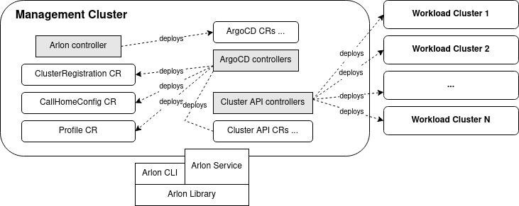

# About Arlon
[](https://app.fossa.com/projects/git%2Bgithub.com%2Fplatform9%2Farlon?ref=badge_shield)
[](https://goreportcard.com/report/github.com/arlonproj/arlon)
[](https://arlon.readthedocs.io/en/latest/?badge=latest)


Arlon is a lifecycle management and configuration tool for Kubernetes clusters.
It allows an administrator to compose, deploy and configure a large number of
*workload clusters* in a structured, predictable way.
Arlon takes advantage of multiple declarative cluster management API providers for the
actual cluster orchestration: the first two supported API providers are
Cluster API and Crossplane.
Arlon uses ArgoCD as the underlying Kubernetes manifest deployment
and enforcement engine.
A workload cluster is composed from the following constructs:
- *Cluster spec*: a description of the infrastructure and external settings of a cluster,
e.g. Kubernetes version, cloud provider, cluster type, node instance type.
- *Profile*: a grouping of configuration bundles which will be installed into the cluster
- *Configuration bundle*: a unit of configuration which contains (or references) one or
more Kubernetes manifests. A bundle can encapsulate anything that can be deployed onto a cluster:
an RBAC ruleset, an add-on, an application, etc... 

# Contents

* [Architecture](#architecture)
* [Concepts](#concepts)
* [Installation](#installation)
* [Tutorial](#tutorial)

# Architecture



Arlon is composed of a controller, a library, and a CLI that exposes the library's
functions as commands. In the future, an API server may be built from
the library as well. Arlon adds CRDs (custom resource definitions) for several
custom resources such as ClusterRegistration and Profile.

## Management cluster
The management cluster is a Kubernetes cluster hosting all the components
needed by Arlon, including:
- The ArgoCD server
- The Arlon "database" (implemented as Kubernetes secrets and configmaps)
- The Arlon controller
- Cluster management API providers: Cluster API or Crossplane
- Custom resources (CRs) that drive the involved providers and controllers
- Custom resource definitions (CRDs) for all of the involved CRs

The user is responsible for supplying the management cluster, and to have
a access to a kubeconfig granting administrator permissions on the cluster.

## Controller

The Arlon controller observes and responds to changes in `clusterregistration`
custom resources. The Arlon library creates a `clusterregistration` at the
beginning of workload cluster creation,
causing the controller to wait for the cluster's kubeconfig
to become available, at which point it registers the cluster with ArgoCD to
enable manifests described by bundles to be deployed to the cluster.

## Library
The Arlon library is a Go module that contains the functions that communicate
with the Management Cluster to manipulate the Arlon state (bundles, profiles, clusterspecs)
and transforms them into git directory structures to drive ArgoCD's gitops engine. Initially, the
library is exposed via a CLI utility. In the future, it may also be embodied
into a server an exposed via a network API.

## Workspace repository
As mentioned earlier, Arlon creates and maintains directory structures in a git
repository to drive ArgoCD *sync* operations.
The user is responsible for supplying
this *workspace repository* (and base paths) hosting those structures.
Arlon relies on ArgoCD for repository registration, therefore the user should
register the workspace registry in ArgoCD before referencing it from Arlon data types.

# Concepts

## Cluster spec

A cluster spec contains desired settings when creating a new cluster.
They currently include:
- API Provider: the cluster orchestration technology. Supported values are `CAPI` (Cluster API) and `xplane` (Crossplane)
- Cloud Provider: the infrastructure cloud provider. The currently supported values is `aws`, with `gcp` and `azure` support coming later.
- Type: the cluster type. Some API providers support more than one type. On `aws` cloud, Cluster API supports `kubeadm` and `eks`, whereas Crossplane only supports `eks`.
- The (worker) node instance type
- The initial (worker) node count
- The Kubernetes version

## Configuration bundle

A configuration bundle (or just "bundle") is grouping of data files that
produce a set of Kubernetes manifests via a *tool*. This closely follows ArgoCD's
definition of *tool types*. Consequently, the list of supported bundle
types mirrors ArgoCD's supported set of manifest-producing tools.
Each bundle is defined using a Kubernetes ConfigMap resource in the arlon namespace.

### Static bundle
A static bundle embeds the manifest's YAML data itself ("static bundle").
A cluster consuming a static bundle will always have a snapshot copy of
the bundle at the time the cluster was created, and is not affected by subsequent
changes to the bundle's manifest data.

### Dynamic bundle
A dynamic bunlde contains a reference to the manifest data stored in git.
A dynamic bundle is distinguished
by having these fields set to non-empty values:
- git URL of the repo
- Directory path within the repo

The git URL must be registered in ArgoCD as a valid repository. The content of
the specified directory can contain manifests in any of the *tool* formats supported
by ArgoCD, including plain YAML, Helm and Kustomize.

When the user updates a dynamic bundle in git, all clusters consuming that bundle
(through a profile specified at cluster creation time) will acquire the change.

### Other properties
A bundle can also have a comma-separated list of tags, and a description.
Tags can be useful for classifying bundles, for e.g. by type
("addon", "cni", "rbac", "app").

## Profile

A profile expresses a desired configuration for a Kubernetes cluster.
It is just a set of references to bundles (static, dynamic, or a combination).
A profile can be static or dynamic.

### Static profile
When a cluster consumes a static profile
at creation time, the set of bundles for the cluster is fixed at that time
and does not change over time even when the static bundle is updated.
(Note: the contents of some of those bundles referenced by the static
profile may however change over time if they are dynamic).
A static profile is stored as an item
in the Arlon database (specifically, as a configmap in the Management Cluster).

### Dynamic profile
A dynamic profile, on the other hand, has two components: the specification
stored in the Arlon database, and a *compiled* component living in the workspace
repository at a path specified by the user.
(Note: this repository is usually the workspace repo, but it technically doesn't
have to be, as long as it's a valid repo registered in ArgoCD)
The compiled component is essentially a
Helm chart of multiple ArgoCD app resources, each one pointing to a bundle.
Arlon automatically creates and maintains the compiled component.
When a user updates the composition of a dynamic profile, meaning redefines its
bundle set, the Arlon library updates the compiled component to point to the
bundles specified in the new set. Any cluster
consuming that dynamic profile will be affected by the change, meaning it may lose
or acquire new bundles in real time.

## Cluster

An Arlon cluster, also known as workload cluster, is a Kubernetes cluster
that Arlon creates and manages via a git directory structure store in
the workspace repository.

(Under construction)

# Installation

We plan to add a CLI command to simplify initial setup. Until then, please
follow these manual instructions.

## Management cluster

You can use any Kubernetes cluster that you have admin access to. Ensure:
- `kubectl` is in your path
- `KUBECONFIG` is pointing to the right file and the context set properly

## ArgoCD

- Follow steps 1-4 of the [ArgoCD installation guide](https://argo-cd.readthedocs.io/en/stable/getting_started/) to install ArgoCD onto your management cluster.
After this step, you should be logged in as `admin` and a config file was created at `${HOME}/.config/argocd/config`
- Create your workspace repository in your git provider if necessary, then register it.
  Example: `argocd repo add https://github.com/myname/arlon_workspace --username myname --password secret`.
   -  Note: type `argocd repo add --help` to see all available options.
   -  For Arlon developers, this is not your fork of the Arlon source code repository, 
       but a separate git repo where some artefacts like profiles created by Arlon will be stored. 
- Highly recommended: [configure a webhook](https://argo-cd.readthedocs.io/en/stable/operator-manual/webhook/)
  to immediately notify ArgoCD of changes to the repo. This will be especially useful
  during the tutorial. Without a webhook, repo changes may take up to 3 minutes
  to be detected, delaying cluster configuration updates. 
- [Create a local user](https://argo-cd.readthedocs.io/en/stable/operator-manual/user-management/) named `arlon` with the `apiKey` capability.
  This involves editing the `argocd-cm` ConfigMap using `kubectl`.
- Adjust the RBAC settings to grant admin permissions to the `arlon` user.
  This involves editing the `argocd-rbac-cm` ConfigMap to add the entry
  `g, arlon, role:admin` under the `policy.csv` section. Example:
```
apiVersion: v1
data:
  policy.csv: |
    g, arlon, role:admin
kind: ConfigMap
[...]
```
- Generate an account token: `argocd account generate-token --account arlon`
- Make a temporary copy of the config file: `cp ${HOME}/.config/argocd/config /tmp/config` then
  edit it to replace the value of `auth-token` with the token from
  the previous step. Save changes. This file will be used to configure the Arlon
  controller's ArgoCD credentials during the next steps.

NOTE: _On some operating systems, including Linux, it's possible the source configuration
file is located at `${HOME}/.argocd/config` instead. In any case, ensure that
the destination file is named `/tmp/config`, it's important for the secret creation step below_.

## Arlon controller
- Create the arlon namespace: `kubectl create ns arlon`
- Create the ArgoCD credentials secret from the temporary config file:
  `kubectl -n arlon create secret generic argocd-creds --from-file /tmp/config`
- Delete the temporary config file
- Clone the arlon git repo and cd to its top directory
- Create the `clusterregistrations` CRD: `kubectl apply -f config/crd/bases/core.arlon.io_clusterregistrations.yaml`
- Deploy the controller: `kubectl apply -f deploy/manifests/`
- Ensure the controller eventually enters the Running state: `watch kubectl -n arlon get pod`

## Arlon CLI
- From the top directory, run `make build`
- Optionally create a symlink from a directory
  (e.g. `/usr/local/bin`) included in your ${PATH} to the `bin/arlon` binary
  to make it easy to invoke the command.

## Cluster orchestration API providers

Arlon currently supports Cluster API on AWS cloud. It also has experimental
support for Crossplane on AWS.

### Cluster API
Using the [Cluster API Quickstart Guide](https://cluster-api.sigs.k8s.io/user/quick-start.html)
as reference, complete these steps:
- Install `clusterctl`
- Initialize the management cluster.
  In particular, follow instructions for your specific cloud provider (AWS in this example)
  Ensure `clusterctl init` completes successfully and produces the expected output.

### Crossplane (experimental)

Using the [Upbound AWS Reference Platform Quickstart Guide](https://github.com/upbound/platform-ref-aws#quick-start)
as reference, complete these steps:
- [Install UXP on your management cluster](https://github.com/upbound/platform-ref-aws#installing-uxp-on-a-kubernetes-cluster)
- [Install Crossplane kubectl extension](https://github.com/upbound/platform-ref-aws#install-the-crossplane-kubectl-extension-for-convenience)
- [Install the platform configuration](https://github.com/upbound/platform-ref-aws#install-the-platform-configuration)
- [Configure the cloud provider credentials](https://github.com/upbound/platform-ref-aws#configure-providers-in-your-platform)

You do not need to go any further, but you're welcome to try the Network Fabric example.

FYI: *we noticed the dozens/hundreds of CRDs that Crossplane installs in the management
cluster can noticeably slow down kubectl, and you may see a warning that looks like*:
```
I0222 17:31:14.112689   27922 request.go:668] Waited for 1.046146023s due to client-side throttling, not priority and fairness, request: GET:https://AA61XXXXXXXXXXX.gr7.us-west-2.eks.amazonaws.com/apis/servicediscovery.aws.crossplane.io/v1alpha1?timeout=32s
``` 

# Tutorial

This assumes that you plan to deploy workload clusters on AWS cloud, with
Cluster API ("CAPI") as the cluster orchestration API provider.
Also ensure you have set up a [workspace repository](#workspace-repository)
and it is registered as a git repo in ArgoCD. The tutorial will assume
the existence of these environment variables:
- `${ARLON_REPO}`: where the arlon repo is locally checked out
- `${WORKSPACE_REPO}`: where the workspace repo is locally checked out
- `${WORKSPACE_REPO_URL}`: the workspace repo's git URL. It typically looks 
like `https://github.com/${username}/${reponame}.git`

_Note: for the best experience, make sure your workspace repo is configured
to send change notifications to ArgoCD via a webhook. See the Installation section for details._
## Cluster specs

We first create a few cluster specs with different combinations of API providers
and cluster types (kubeadm vs EKS).
One of the cluster specs is for an unconfigured API provider (Crossplane);
this is for illustrative purposes, since we will not use it in this tutorial.

```
arlon clusterspec create capi-kubeadm-3node --api capi --cloud aws --type kubeadm --kubeversion v1.18.16 --nodecount 3 --nodetype t2.medium --tags devel,test --desc "3 node kubeadm for dev/test"
arlon clusterspec create capi-eks --api capi --cloud aws --type eks --kubeversion v1.18.16 --nodecount 2 --nodetype t2.large --tags staging --desc "2 node eks for general purpose"
arlon clusterspec create xplane-eks-3node --api xplane --cloud aws --type eks --kubeversion v1.18.16 --nodecount 4 --nodetype t2.small --tags experimental --desc "4 node eks managed by crossplane"
```
Ensure you can now list the cluster specs:
```
$ arlon clusterspec list
NAME                APIPROV  CLOUDPROV  TYPE     KUBEVERSION  NODETYPE   NODECOUNT  TAGS          DESCRIPTION
capi-eks            capi     aws        eks      v1.18.16     t2.large   2          staging       2 node eks for general purpose
capi-kubeadm-3node  capi     aws        kubeadm  v1.18.16     t2.medium  3          devel,test    3 node kubeadm for dev/test
xplane-eks-3node    xplane   aws        eks      v1.18.16     t2.small   4          experimental  4 node eks managed by crossplane
```

## Bundles

First create a static bundle containing raw YAML for the `guestbook`
sample application from this example file:
```
cd ${ARLON_REPO}
arlon bundle create guestbook-static --tags applications --desc "guestbook app" --from-file examples/bundles/guestbook.yaml
```
(_Note: the YAML is simply a concatenation of the files found in the
[ArgoCD Example Apps repo](https://github.com/argoproj/argocd-example-apps/tree/master/guestbook)_)

To illustrate the difference between static and dynamic bundles, we create
a dynamic version of the same application, this time using a reference to a
git directory containing the YAML. We could point it directly to the copy in the
[ArgoCD Example Apps repo](https://github.com/argoproj/argocd-example-apps/tree/master/guestbook),
but we'll want to make modifications to it, so we instead create a new directory
to host our own copy in our workspace directory:
```
cd ${WORKSPACE_REPO}
mkdir -p bundles/guestbook
cp ${ARLON_REPO}/examples/bundles/guestbook.yaml bundles/guestbook
git add bundles/guestbook
git commit -m "add guestbook"
git push origin main
arlon bundle create guestbook-dynamic --tags applications --desc "guestbook app (dynamic)" --repo-url ${WORKSPACE_REPO_URL} --repo-path bundles/guestbook
```

Next, we create a static bundle for another "dummy" application,
an Ubuntu pod (OS version: "Xenial") that does nothing but print the date-time
in an infinite sleep loop:
```
cd ${ARLON_REPO}
arlon bundle create xenial-static --tags applications --desc "xenial pod" --from-file examples/bundles/xenial.yaml
```
Finally, we create a bundle for the Calico CNI, which provides pod networking.
Some types of clusters (e.g. kubeadm) require a CNI provider to be installed
onto a newly created cluster, so encapsulating the provider as a bundle will
give us a flexible way to install it. We download a known copy from the
authoritative source and store it the workspace repo in order to create a
dynamic bundle from it:
```
cd ${WORKSPACE_REPO}
mkdir -p bundles/calico
curl https://docs.projectcalico.org/v3.21/manifests/calico.yaml -O > bundles/calico/calico.yaml
git add bundles/calico
git commit -m "add calico"
git push origin main
arlon bundle create calico --tags networking,cni --desc "Calico CNI" --repo-url https://github.com/argoproj/argocd-example-apps.git --repo-path bundles/guestbook
```

List your bundles to verify they were correctly entered:
```
$ arlon bundle list
NAME               TYPE     TAGS                 REPO-URL                                             REPO-PATH              DESCRIPTION
calico             dynamic  networking,cni       ${WORKSPACE_REPO_URL}                                bundles/calico         Calico CNI
guestbook-dynamic  dynamic  applications         ${WORKSPACE_REPO_URL}                                bundles/guestbook      guestbook app (dynamic)
guestbook-static   static   applications         (N/A)                                                (N/A)                  guestbook app
xenial-static      static   applications         (N/A)                                                (N/A)                  ubuntu pod in infinite sleep loop
```

## Profiles
We can now create profiles to group bundles into useful, deployable sets.
First, create a static profile containing bundles xenial-static and guestbook-static:

```
arlon profile create static-1 --bundles guestbook-static,xenial --desc "static profile 1" --tags examples
```

Secondly, create a dynamic version of the same profile. We'll store the compiled
form of the profile in the `profiles/dynamic-1` directory of the workspace repo. We don't create
it manually; instead, the arlon CLI will create it for us, and it will push
the change to git:
```
arlon profile create dynamic-1 --repo-url ${WORKSPACE_REPO_URL} --repo-base-path profiles --bundles guestbook-static,xenial --desc "dynamic test 1" --tags examples
```
_Note: the `--repo-base-path profiles` option tells arlon to create the profile
under a base directory `profiles/` (to be created if it doesn't exist). That
is in fact the default value of that option, so it is not necessary to specify
it in this case._

To verify that the compiled profile was created correctly:
```
$ cd ${WORKSPACE_REPO}
$ git pull
$ tree profiles
profiles
├── dynamic-1
│   ├── mgmt
│   │   ├── Chart.yaml
│   │   └── templates
│   │       ├── guestbook-dynamic.yaml
│   │       ├── placeholder_configmap.yaml
│   │       └── xenial.yaml
│   └── workload
│       └── xenial
│           └── xenial.yaml
[...]
```
Since `xenial` is a static bundle, a copy of its YAML was stored in `workload/xenial/xenial.yaml`.
This is not done for `guestbook-dynamic` because it is dynamic.

Finally, we create another variant of the same profile, with the only difference
being the addition of Calico bundle. It'll be used on clusters that need a CNI provider:
```
arlon profile create dynamic-2-calico --repo-url ${WORKSPACE_REPO_URL} --repo-base-path profiles --bundles calico,guestbook-dynamic,xenial --desc "dynamic test 1" --tags examples
```
Listing the profiles should show:
```
$ arlon profile list
NAME              TYPE     BUNDLES                          REPO-URL               REPO-PATH                  TAGS         DESCRIPTION
dynamic-1         dynamic  guestbook-static,xenial          ${WORKSPACE_REPO_URL}  profiles/dynamic-1         examples     dynamic test 1
dynamic-2-calico  dynamic  calico,guestbook-static,xenial   ${WORKSPACE_REPO_URL}  profiles/dynamic-2-calico  examples     dynamic test 1
static-1          static   guestbook-dynamic,xenial         (N/A)                  (N/A)                      examples     static profile 1
```

## Clusters

We are now ready to deploy our first cluster. It will be of type EKS. Since
EKS clusters come configured with pod networking out of the box, we choose
a profile that does not include Calico: `dynamic-1`.
When deploying a cluster, arlon creates in git a Helm chart containing
the manifests for creating and bootstrapping the cluster.
Arlon then creates an ArgoCD App referencing the chart, thereby relying
on ArgoCD to orchestrate the whole process of deploying and configuring the cluster.
The arlon `deploy` command
accepts a git URL and path for this git location. Any git repo can be used (so long
as it's registered with ArgoCD), but we'll use the workspace cluster for
convenience:
```
arlon cluster deploy --repo-url ${WORKSPACE_REPO_URL} --cluster-name eks-1 --profile dynamic-1 --cluster-spec capi-eks
```
The git directory hosting the cluster Helm chart is created as a subdirectory
of a base path in the repo. The base path can be specified with `--base-path`, but
we'll leave it unspecified in order to use the default value of `clusters`.
Consequently, this example produces the directory `clusters/eks-1/` in the repo.
To verify its presence:
```
$ cd ${WORKSPACE_REPO}
$ git pull
$ tree clusters/eks-1
clusters/eks-1
└── mgmt
    ├── charts
    │   ├── capi-aws-eks
    │   │   ├── Chart.yaml
    │   │   └── templates
    │   │       └── cluster.yaml
    │   ├── capi-aws-kubeadm
    │   │   ├── Chart.yaml
    │   │   └── templates
    │   │       └── cluster.yaml
    │   └── xplane-aws-eks
    │       ├── Chart.yaml
    │       └── templates
    │           ├── cluster.yaml
    │           └── network.yaml
    ├── Chart.yaml
    ├── templates
    │   ├── clusterregistration.yaml
    │   ├── ns.yaml
    │   ├── profile.yaml
    │   └── rbac.yaml
    └── values.yaml
```
The chart contains several subcharts under `mgmt/charts/`,
one for each supported type of cluster. Only one of them will be enabled,
in this case `capi-aws-eks` (Cluster API on AWS with type EKS).

At this point, the cluster is provisioning and can be seen in arlon and AWS EKS:
```
$ arlon cluster list
NAME       CLUSTERSPEC  PROFILE  
eks-1      capi-eks     dynamic-1

$ aws eks list-clusters
{
    "clusters": [
        "eks-1_eks-1-control-plane",
    ]
}
```
Eventually, it will also be seen as a registered cluster in argocd, but this
won't be visible for a while, because the cluster is not registered until
its control plane (the Kubernetes API) is ready:
```
$ argocd cluster list
SERVER                                                                    NAME        VERSION  STATUS      MESSAGE
https://9F07DC211252C6F7686F90FA5B8B8447.gr7.us-west-2.eks.amazonaws.com  eks-1       1.18+    Successful  
https://kubernetes.default.svc                                            in-cluster  1.20+    Successful  
```

To monitor the progress of the cluster deployment, check the status of
the ArgoCD app of the same name:
```
$ argocd app list
NAME                         CLUSTER                         NAMESPACE  PROJECT  STATUS  HEALTH   SYNCPOLICY  CONDITIONS  REPO                   PATH                                          TARGET
eks-1                        https://kubernetes.default.svc  default    default  Synced  Healthy  Auto-Prune  <none>      ${WORKSPACE_REPO_URL}  clusters/eks-1/mgmt                           main
eks-1-guestbook-static                                       default    default  Synced  Healthy  Auto-Prune  <none>      ${WORKSPACE_REPO_URL}  profiles/dynamic-1/workload/guestbook-static  HEAD
eks-1-profile-dynamic-1      https://kubernetes.default.svc  argocd     default  Synced  Healthy  Auto-Prune  <none>      ${WORKSPACE_REPO_URL}  profiles/dynamic-1/mgmt                       HEAD
eks-1-xenial                                                 default    default  Synced  Healthy  Auto-Prune  <none>      ${WORKSPACE_REPO_URL}  profiles/dynamic-1/workload/xenial            HEAD
```
The top-level app `eks-1` is the root of all argocd apps that make up the
cluster and its configuration contents. The next level app `eks-1-profile-dynamic-1`
represents the profile, and its children apps `eks-1-guestbook-static` and `eks-1-xenial`
correspond to the bundles.

_Note: The overall tree-like organization of the apps and their health status
can be visually observed in the ArgoCD web user interface._

The cluster is fully deployed once those apps are all `Synced` and `Healthy`.
An EKS cluster typically takes 10-15 minutes to finish deploying.

## Behavioral differences between static and dynamic bundles & profiles

**Static bundle**

A change to a static bundle does not affect existing clusters using that bundle
(through a profile). To illustrate this, bring up the ArgoCD UI and
open the detailed view of the `eks-1-guestbook-static` application,
which applies the `guestbook-static` bundle to the `eks-1` cluster.
Note that there is only one `guestbook-ui` pod.

Next, update the `guestbook-static` bundle to have 3 replicas of the pod:
```
arlon bundle update guestbook-static --from-file examples/bundles/guestbook-3replicas.yaml
```
Note that the UI continues to show one pod. Only new clusters consuming
this bundle will have the 3 replicas.

**Dynamic profile**

Before discussing dynamic bundles, we take a small detour to introduce
dynamic profiles, since this will help understand the relationship between
profiles and bundles.
To illustrate how a profile can be updated, we remove `guestbook-static` bundle
from `dynamic-1` by specifying a new bundle set:
```
arlon profile update dynamic-1 --bundles xenial
```
Since the old bundle set was `guestbook-static,xenial`, that command resulted
in the removal of `guestbook-static` from the profile.
In the UI, observe the `eks-1-profile-dynamic-1` app going through Sync
and Progressing phases, eventually reaching the healthy (green) state.
And most importantly, the `eks-1-guestbook-static` app is gone. The reason
this real-time change to the cluster was possible is that the `dynamic-1`
profile is dynamic, meaning any change to its composition results in arlon
updating the corresponding compiled Helm chart in git. ArgoCD detects this
git change and propagates the app / configuration updates to the cluster.

If the profile were of the static type, a change in its composition (the
set of bundles) would _not_ have affected existing clusters using that profile.
It would only affect new clusters created with the profile.

**Dynamic bundle**

To illustrate the defining characteristic of a dynamic bundle, we first add
`guestbook-dynamic` to `dynamic-1`:
```
arlon profile update dynamic-1 --bundles xenial,guestbook-dynamic
```
Observe the re-appearance of the guestbook application, which is managed
by the `eks-1-guestbook-dynamic` ArgoCD app. A detailed view of the app
shows 1 guestbook-ui pod. Remember that a dynamic bundle's
manifest content is stored in git. Use these commands to change the number
of pod replicas to 3:
```
cd ${WORKSPACE_REPO}
git pull # to get all latest changes pushed by arlon
vim bundles/guestbook/guestbook.yaml # edit to change deployment's replicas to 3
git commit -am "increase guestbook replicas"
git push origin main
```
Observe the number of pods increasing to 3 in the UI. Any existing cluster
consuming this dynamic bundle will be updated similarly, regardless of whether
the bundle is consumed via a dynamic or static profile.

**Static profile**

Finally, a profile can be static. It means that it has no corresponding
"compiled" component (a Helm chart) living in git. When a cluster is
deployed using a static profile, the set of bundles (whether static or
dynamic) it receives is determined by the bundle set defined by the profile at deployment
time, and will not change in the future, even if the profile is updated to
a new set at a later time.

## Cluster updates and upgrades

The `arlon cluster update [flags]` command allows you to make changes to
an existing cluster. The clusterspec, profile, or both can change, provided
that the following rules and guidelines are followed.

### Clusterspec

There are two scenarios. In the first, the clusterspec name associated with the
cluster hasn't changed, meaning the cluster is using the same clusterspec.
However, some properties of the clusterspec's properties have changed since
the cluster was deployed or last updated, using `arlon clusterspec update`
Arlon supports updating the cluster
to use updated values of the following properties:
- kubernetesVersion
- nodeCount
- nodeType

_Note: Updating the cluster is not allowed if other properties of its clusterspec
(e.g. cluster orchestration API provider, cloud, cluster type, region, pod CIDR block, etc...)
have changed, however new clusters can always be created/deployed using the
changed clusterspec._

A change in `kubernetesVersion` will result in a cluster upgrade/downgrade.
There are some restrictions and caveats you need to be aware of:
- The specific Kubernetes version must be supported by the particular 
  implementation and release of the underlying cluster orchestration API provider,
  cloud, and cluster type.
- In general, the control plane will be upgraded first
- Existing nodes are not typically not upgraded to the new Kubernetes version.
  Only new nodes (added as part of manual `nodeCount` change or autoscaling)
  
In the second scenario, as part of an update operation, you may choose to
associate the cluster with a different clusterspec altogether. 
The rule governing the allowed property changes remains the same: the cluster
update operation is allowed if, relative to the previously associated clusterspec, 
the new clusterspec's properties differ only in the values listed above.

### Profile
You can specify a completely different profile when updating a cluster.
All bundles previously used will be removed from the cluster, and new ones
specified by the new profile will be applied. This is regardless of whether
the old and new profiles are static or dynamic.

### Examples
These sequence of commands updates a clusterspec to a newer Kubernetes version
and a higher node count, then upgrades the cluster to the newer specifications:
```
arlon clusterspec update capi-eks --nodecount 3 --kubeversion v1.19.15
arlon cluster update eks-1
```
Note that the 2nd command didn't need any flags because the clusterspec used
is the same as before.

This example updates a cluster to use a new profile `my-new-profile`:
```
arlon cluster update eks-1 --profile my-new-profile
```
# Implementation details


## Cluster chart

The cluster chart is a Helm chart that creates (and optionally applies) the
manifests necessary to create a cluster and deploy desired configurations
and applications to it. When a user uses Arlon to create and configure a cluster,
he or she specifies a profile. The profile's cluster specification, bundle
list and other settings are used to generate values for the chart, and the
chart is deployed as a Helm release into the *arlon* namespace in the
management cluster.

Here is a summary of the kinds of resources generated and deployed by the chart:
- A unique namespace with a name based on the cluster's name. All subsequent
  resources below are created inside of that namespace.
- The stack-specific resources to create the cluster (for e.g. Cluster API resources)
- A `clusterregistration` to automatically register the cluster with ArgoCD
- A GitRepoDir to automatically create a git repo and/or directory to host a copy
  of the expanded bundles. Every bundle referenced by the profile is
  copied/unpacked into its own subdirectory.
- One ArgoCD Application resource for each bundle.


## License
[](https://app.fossa.com/projects/git%2Bgithub.com%2Fplatform9%2Farlon?ref=badge_large)
