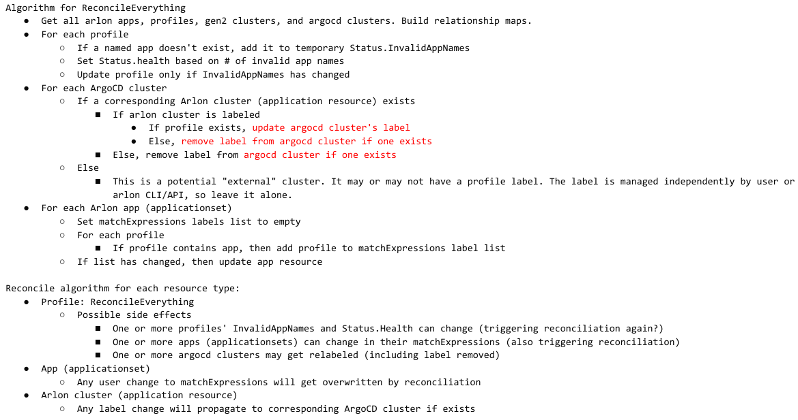

# Gen2 Profiles - Proposal 2

This is an update to the previous [Proposal 1 for Gen2 Profiles](gen2_profiles_proposal_1.md) design.
The main change is the introduction of the new **AppProfile** custom resource,
which elevates profiles to first-class objects. The rest of the design
remains mostly unchanged, meaning Arlon apps are still based on ApplicationSets,
and a cluster is associated with an AppProfile by labeling it, except the
labeling is handled slightly differently (see [Labeling Algorithm](#Labeling-Algorithm)).
AppProfiles are now the source of truth for profile-to-app mappings.
A new controller was introduced to reconcile not only AppProfiles,
but clusters and ApplicationSets as well since they are all inter linked.
  
## Object model

* *Arlon Application* (or *App* for short): a thin wrapper around an ApplicationSet.
  An ApplicationSet is an Arlon Application if it has the `managed-by=arlon` label.

* *App Profile*: a uniquely named set of Arlon Applications. It is backed by a new custom resource and CRD.
  (The resource is named **AppProfile** to distinguish it from the gen1 **Profile** resource. Even though
  gen1 profiles will deprecated and eventually retired, the naming scheme avoids conflicts during the transition).

- *Arlon Cluster*: a gen2 cluster created by Arlon.
  - As a reminder, it is represented by between 2 and 3 ArgoCD Application resources:
    - The cluster application (named with the workload cluster name)
    - The arlon application (named by appending the -arlon suffix to the cluster application's name)
    - The optional profile application (named by appending -profile suffix to the cluster application's name)
  - The first application (the cluster application) is treated as the anchor for the entire set. When an Arlon Cluster
    is associated with an AppProfile, the cluster application will be labeled with the AppProfile's name.
  - An Arlon Cluster that was successfully deployed always has an associated ArgoCD cluster (thanks to the ClusterRegistration mechanism).
 
* *ArgoCD Cluster*: the set of ArgoCD clusters is a superset of Arlon clusters.

* *External Cluster*: any ArgoCD cluster that was not created by Arlon.
  So essentially `External Clusters Set = ArgoCD Clusters Set - Arlon Clusters Set`.
  A user may want to associate an external cluster with an app profile.

Observations:

- An app profile can be associated with (or "contain") any number of applications
- And an app can be associated with multiple profiles.
- A cluster is said to be associated with a profile if it is labeled with `arlon.io/profile=<profileName>`.
- A cluster can be associated with **at most one** profile. A profile may be associated (attached to) any number of clusters.

This table summarizes the actual resources backing the objects:
| Object Type        | Actual Resource        |
|--------------------|------------------------|
| Arlon Application  | ArgoCD ApplicationSet  |
| AppProfile         | AppProfile             |
| Arlon Cluster      | ArgoCD Application     |
| ArgoCD Cluster     | Kubernetes Secret      |

## Labeling Algorithm

Just like in proposal 1, associating a cluster with an app profile is done by labeling the cluster
with the profile's name, and ensuring that that name is included in the corresponding ApplicationSet's
`matchExpressions` values list. But there are some differences:

- For an Arlon cluster, which is anchored by an ArgoCD Application resource,
  the user should label the Application resource, not the corresponding ArgoCD cluster.
  The new AppProfile controller will propagate the label to the corresponding ArgoCD cluster.
  This allows the user to deploy an Arlon cluster, create and populate a profile, and associate
  the cluster to the profile all in one declarative "apply" operation. (A user can't label
  an ArgoCD cluster that doesn't exist yet)
- For non-Arlon clusters, generally referred as "external", the design allows those existing
  ArgoCD clusters to be labeled directly, but this will be managed outside of the AppProfiles controller
  and essentially the user's responsibility, and has limitations.

## Controller

A new controller was developed to not only reconcile AppProfiles, but also clusters and ApplicationSets
(those representing Arlon Applications) since they are now all inter linked through profiles.

- The main controller logic resides in `pkg/appprofile/reconcile.go` and `controllers/appprofile_controller.go`.
- Additionally, logic was added to reconcile ArgoCD applications (representing Arlon clusters) and
  ArgoCD ApplicationSets (representing Arlon apps) with the relationships defined by AppProfiles:
  - `controllers/application_controller.go`
  - `controllers/applicationset_controller.go`
- The new logic will be eventually merged into the main controller. In the prototype, it is available as a separate CLI command
  to simplify testing: `arlon appprofile-controller`.
The reconciliation algorithm is complex due to the number of interdependent resources.
See [Appendix A: Reconciliation Algorithm](#Appendix-A-Reconciliation-Algorithm) for details.

## Usage

Since all objects direcly map to Kubernetes resources, the user can in theory manage everything
with `kubectl [create/apply/edit/delete/lebel]`. However, the arlon CLI and API are still useful
for some things as explained below.

### Creating an initial Arlon Application

Even though an Arlon app is directly represented by an ApplicationSet, the resource has strict
requirements, so it's easiest to create it with the help of the future `arlon app create`, which can
create the resource directly or dump its YAML to standard out. (This command is not yet implemented
in the initial Proposal 2 prototype).

The requirements on the ApplicationSet are:

- Must have the `arlon-type=application` label.
- The spec's `generators` section must use a single generator with a `matchExpressions` selector with
  the `arlon.io/profile` key and `In` as operator.  (Note: the `values` field will later be
  set the AppProfile controller, automatically)
- The spec's `template` section must templatize the generated ArgoCD application names
  based on the workload cluster name. The user is free to configure the template's
  `spec` subsection to target any manifest or Helm chart in git.

Example:

```yaml
apiVersion: argoproj.io/v1alpha1
kind: ApplicationSet
metadata:
  labels:
    arlon-type: application
  name: guestbook
  namespace: argocd
spec:
  generators:
  - clusters:
      selector:
        matchExpressions:
        - key: arlon.io/profile
          operator: In
          values: []
  template:
    metadata:
      name: '{{name}}-appset-guestbook'
    spec:
      destination:
        namespace: default
        server: '{{server}}'
      project: default
      source:
        path: guestbook
        repoURL: https://github.com/argoproj/argocd-example-apps/
        targetRevision: HEAD
      syncPolicy:
        automated:
          prune: true
```
  
### Managing Application Profiles

An AppProfile is a new custom resource with a simple spec: a list of Arlon Application names:

```yaml
apiVersion: core.arlon.io/v1
kind: AppProfile
metadata:
  name: engineering
  namespace: arlon
spec:
  appNames:
  - guestbook
  - wordpress
  - nginx
status:
  health: degraded
  invalidAppNames:
  - wordpress
  - nginx
```

* The resource also has a Status field that the controller updates.
* The `Status.health` subfield is either `healthy` or `degraded`. Degraded means that one or more specified apps don't exist.
* The `Status.invalidAppNames` indicates which app names are invalid, if any.

The presence of the `Status` section is a result of the decision to validate the profile asynchronously and allow invalid app
names to be specified. This generally results in a simpler design, and follows the Kubernetes philosophy of allowing a user
to specify any `spec` and report status later, after reconciliation. The alternative would have been to validate the app names
synchronously using a webhook. This alternative was not currently chosen due to the complexity of webhook devopment and testing,
but may be reconsidered in the future if a good use case arises.

- Updating a profile's `Spec.appNames` can have immediate side effects:
  corresponding ArgoCD Applications can be deployed or destroyed in any clusters labeled with the profile name,
  as soon as the controller finishes reconciliation.
- To list profiles: `kubectl -n arlon get appprofiles`
- To delete a profile: `kubectl -n arlon delete appprofile <name>`. As expected, this command can have immediate effects on impacted clusters.

### Associating profiles with Arlon clusters

A cluster can have at most one profile attached to it. The labeling mechanism can be viewed as an internal
Arlon implementation detail, and it will be hidden from users with `arlon` CLI providing commands to
attach/detach profiles to/from clusters,
but until that's implemented, the user can achieve the same effect by using Kubernetes labeling directly:

- To attach a profile to an Arlon cluster, simply label the corresponding anchor ArgoCD Application as follows:
  - `kubectl -n argocd label application --overwrite <clusterName> arlon.io/profile=<profileName>`
- To detach, remove the label:
  - `kubectl -n argocd label application <clusterName> arlon.io/profile-`

In addition to those raw kubectl commands, we propose to add arlon CLI commands and APIs to slightly simplify the task
and abstract out the labeling.

### Associating profiles with external clusters (experimental, not tested yet)

An external cluster does not have an Arlon representation (meaning there is no "anchor" ArgoCD Application with the same name).
It can still be associated with an AppProfile by labeling the raw ArgoCD cluster:

- Unfortunately as of ArgoCD 2.4, there is no argocd CLI command to label a cluster
- A user can still manually label the **secret** resource where ArgoCD stores the cluster's metadata and credentials. This requires some work,
  as those secrets are named using an non-obvious convention.
- The best thing Arlon should do is to provide dedicated CLI commands and APIs to simplify this task.

## Fully declarative initialization

Now that all Arlon concepts are represented by declarative resources, it is now possible to provision a complete set of resources
with a single `kubectl apply -f` on a file or folder of manifests. In particular, we can now develop a fully self-contained
demo folder that contains all of these resources containing references to each other:

- App Profiles
- Apps
- Arlon Clusters

The user can then `kubectl apply -f` the whole folder and observe the automatic creation of the cluster(s), profiles, and apps.

(Note: the workload clusters need a cluster template in git. This can be supplied by the Arlon repo itself. This does point to
an issue that may become a problem later on: cluster templates don't have a representation today. There is no registration
mechanism for them. The user is expected to "know" where his/her cluster templates reside, and is responsible for specifying
their git location when creating new workload clusters)

## Application Overrides

Given that an Arlon Application is just a specialized ApplicationSet, it inherits an ApplicationSet's
ability to specify a full ArgoCD Application spec, and this spec can contain overrides for Helm charts.

- This does mean that every different permutation of override values requires a new ApplicationSet, and therefore Arlon Application.
- This may be reasonable if we accept that an Arlon Application is not a true application, but rather, an intermediate object that points
  to the true application source residing in Git. The intermediate object can be viewed as a customization or specialization of the
  application source, so it's ok to have multiple intermediate objects, each holding a different set of customizations.

## Issues & Limitations

The remaining issues & limitations raised in Proposal 1 still apply:

- Only one profile per cluster
- Inherits any limitations of ApplicationSets
- Does not support ApplicationSets with other types of generators
- Makes Arlon even more dependent on ArgoCD technology
- There is no way to create a per-cluster application override, unless the user creates a unique and dedicated Arlon Application for
  the cluster, places it in a dedicated profile, and applies the profile to the cluster.

## Appendix A: Reconciliation Algorithm

The pseudocode looks something like:


